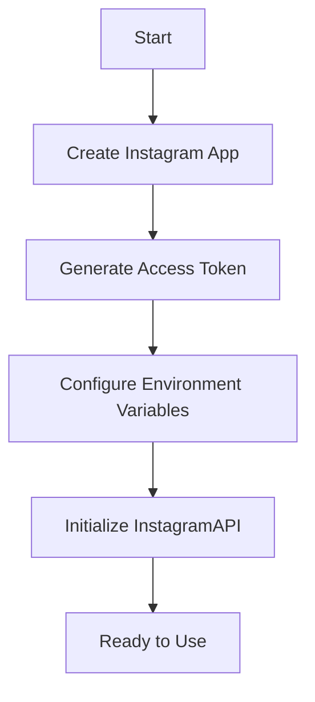

# Instagram Authentication

## Overview

Instagram uses OAuth 2.0 with long-lived access tokens for API authentication. This document covers authentication setup and management for comment moderation operations.

## Authentication Methods

### OAuth 2.0 Bearer Token (Recommended)

**Description**: Token-based authentication for read-only operations

| Attribute | Value |
|-----------|--------|
| **Token Type** | Long-lived access token |
| **Lifetime** | 60 days (renewable) |
| **Scopes** | `instagram_basic`, `pages_read_engagement` |
| **Use Case** | Reading posts, fetching comments |
| **Rate Limits** | 5,000 requests/hour |

### OAuth 2.0 with User Context

**Description**: Full read/write access with user context

| Attribute | Value |
|-----------|--------|
| **Token Type** | Long-lived access token |
| **Lifetime** | 60 days (renewable) |
| **Scopes** | `instagram_basic`, `pages_manage_metadata`, `pages_read_engagement`, `pages_manage_engagement` |
| **Use Case** | Moderating comments, deleting content |
| **Rate Limits** | 200-500 requests/hour |

## Required Permissions

### Basic Display API (Read Operations)

```bash
instagram_basic
pages_read_engagement
```

**Allows**:
- Fetch media posts
- Read comments
- Access engagement metrics
- Read user profiles

### Full API (Read/Write Operations)

```bash
instagram_basic
pages_read_engagement
pages_manage_metadata
pages_manage_engagement
```

**Allows**:
- All Basic Display API permissions
- Manage page metadata
- Moderate and delete comments (page's comments)
- Reply to comments
- Hide comments

## Getting Access Tokens

### 1. Create Instagram App

1. Go to [Meta for Developers](https://developers.facebook.com/)
2. Create a new app (Instagram Basic Display API)
3. Configure app settings and generate access token
4. Select required permissions (see above)
5. Save access token securely

### 2. Generate Access Token

**Via Meta Developer Portal:**

1. Navigate to your app settings
2. Click "Generate Access Token"
3. Select permissions for your use case
4. Exchange authorization code for token
5. Copy generated token

**Token Format**:
```
Instagram Access Token
----------------------------
Your long-lived access token: IGQWR...
Lifetime: 60 days
Permissions: instagram_basic,pages_read_engagement
```

## Environment Setup

### Configuration File

Create `.env` file:

```bash
# Instagram Authentication
INSTAGRAM_ACCESS_TOKEN=your_long_lived_access_token_here
INSTAGRAM_APP_ID=your_app_id
INSTAGRAM_APP_SECRET=your_app_secret
```

### Python Configuration

```python
import os
from moderation_ai.platforms import InstagramAPI

# From environment variables
instagram = InstagramAPI.from_env()

# Or with explicit credentials
instagram = InstagramAPI(
    access_token=os.environ.get("INSTAGRAM_ACCESS_TOKEN"),
    app_id=os.environ.get("INSTAGRAM_APP_ID"),
    app_secret=os.environ.get("INSTAGRAM_APP_SECRET")
)
```

## Token Management

### Token Validation

```python
from moderation_ai.utils import AuthenticationError

async def validate_token(instagram):
    """
    Validate Instagram access token.
    """
    try:
        # Make a test API call
        user_info = await instagram.get_user_info()
        print(f"Token valid for user: {user_info.username}")
        return True
    except AuthenticationError as e:
        print(f"Token invalid: {e}")
        return False
```

### Token Refresh

Instagram long-lived tokens are valid for 60 days:

```python
import asyncio
from datetime import datetime, timedelta

async def check_token_expiry(instagram):
    """
    Check and refresh token if needed.
    """
    # Instagram tokens are long-lived (60 days)
    # Monitor for authentication failures
    try:
        user_info = await instagram.get_user_info()
        print(f"Token still valid")
    except AuthenticationError as e:
        print(f"Token expired or invalid: {e}")
        # Generate new token
        new_token = await refresh_instagram_token()
        instagram.access_token = new_token
        print("Token refreshed")

async def refresh_instagram_token():
    """
    Generate a new Instagram access token.
    """
    # Implement OAuth flow to get new token
    # This requires user interaction or app credentials
    # For automation, store new token and update config
    pass
```

## Authentication Flow

### Initial Setup



### Runtime Authentication

```python
class InstagramAuthManager:
    """
    Manage Instagram authentication state.
    """
    
    def __init__(self, config):
        self.config = config
        self.token = None
        self.authenticated = False
    
    async def authenticate(self):
        """
        Authenticate with Instagram API.
        """
        # Try existing token
        if self.token:
            if await self.validate_token(self.token):
                self.authenticated = True
                return
        
        # Generate new token
        self.token = await self.generate_token()
        self.authenticated = True
    
    async def validate_token(self, token):
        """
        Validate token is still valid.
        """
        try:
            user_info = await self.api_get_user_info(token)
            return True
        except Exception as e:
            return False
    
    async def generate_token(self):
        """
        Generate new access token.
        """
        # Implement OAuth flow
        return "new_token_here"
    
    async def reauthenticate(self):
        """
        Force re-authentication.
        """
        self.token = await self.generate_token()
        self.authenticated = True
```

## Security Best Practices

### Token Storage

1. **Environment Variables**: Store tokens in `.env` file (never in code)
2. **Secret Management**: Use secret manager for production
3. **File Permissions**: Set `.env` file to `600` (read/write for owner only)
4. **Git Exclusion**: Add `.env` to `.gitignore`
5. **Access Control**: Limit access to authentication data

### Token Security

- ✅ **Never commit** tokens to version control
- ✅ **Use different tokens** for development and production
- ✅ **Rotate tokens** regularly (every 60 days)
- ✅ **Revoke old tokens** when rotating
- ✅ **Monitor token usage** for suspicious activity
- ✅ **Implement token scope** - request minimum permissions needed

## Error Handling

### Common Authentication Errors

| Error | Cause | Solution |
|-------|--------|----------|
| **400 Bad Request** | Invalid token format | Check token syntax |
| **401 Unauthorized** | Invalid or expired token | Regenerate token |
| **403 Forbidden** | Insufficient permissions | Request additional scopes |
| **429 Too Many Requests** | Rate limit exceeded | Implement backoff |
| **500 Server Error** | Instagram API issue | Retry with backoff |

### Error Handling Code

```python
from moderation_ai.utils import AuthenticationError, RateLimitError

async def safe_api_call(instagram, func, *args, **kwargs):
    """
    Execute API call with proper error handling.
    """
    max_retries = 3
    base_delay = 1  # seconds
    
    for attempt in range(max_retries):
        try:
            result = await func(*args, **kwargs)
            return result
        except AuthenticationError as e:
            print(f"Authentication failed: {e}")
            # Try re-authenticating
            await instagram.reauthenticate()
            continue
        except RateLimitError as e:
            wait_time = base_delay * (2 ** attempt)
            print(f"Rate limited, waiting {wait_time}s")
            await asyncio.sleep(wait_time)
            continue
        except Exception as e:
            print(f"Unexpected error: {e}")
            if attempt == max_retries - 1:
                raise
    
    raise Exception("Max retries exceeded")
```

## Permission Scopes

### Required Scopes by Operation

| Operation | Required Scopes |
|-----------|-----------------|
| **Fetch Posts** | `instagram_basic`, `pages_read_engagement` |
| **Fetch Comments** | `instagram_basic`, `pages_read_engagement` |
| **Moderate Comment** | `pages_manage_engagement` |
| **Hide Comment** | `pages_manage_engagement` |
| **Delete Comment** | `pages_manage_engagement` |
| **Reply to Comment** | `pages_manage_engagement` |

## Testing Authentication

### Development Environment

```python
# Use test access token
INSTAGRAM_ACCESS_TOKEN=test_token_here

# Verify token works
instagram = InstagramAPI(access_token="test_token")
user = await instagram.get_user_info()
print(f"Authenticated as: {user.username}")
```

### Production Environment

```python
import os
from dotenv import load_dotenv

# Load from environment
load_dotenv()

# Initialize with production token
instagram = InstagramAPI.from_env()
```

## Multi-Account Support

```python
class InstagramMultiAccount:
    """
    Manage multiple Instagram accounts.
    """
    
    def __init__(self):
        self.accounts = {}
    
    def add_account(self, name, access_token):
        """
        Add an account to manager.
        """
        self.accounts[name] = InstagramAPI(access_token=access_token)
    
    async def switch_account(self, name):
        """
        Switch to a different account.
        """
        if name in self.accounts:
            return self.accounts[name]
        raise ValueError(f"Account {name} not found")
    
    def get_account(self, name):
        """
        Get an Instagram account instance.
        """
        return self.accounts.get(name)
```

## Webhooks Support

Instagram supports webhooks for various events:

```python
from fastapi import FastAPI
from moderation_ai.platforms import InstagramAPI

app = FastAPI()
instagram = InstagramAPI.from_env()

@app.post("/webhooks/instagram")
async def instagram_webhook(event: dict):
    """
    Handle Instagram webhook events.
    """
    event_type = event.get("event_type")
    
    if event_type == "comment_created":
        # New comment notification
        comment_id = event.get("comment_id")
        await process_new_comment(comment_id)
    
    elif event_type == "comment_flagged":
        # Comment flagged for review
        comment_id = event.get("comment_id")
        await handle_flagged_comment(comment_id)
    
    return {"status": "received"}

async def process_new_comment(comment_id):
    """
    Process newly created comment.
    """
    # Fetch comment details
    comment = await instagram.fetch_comment(comment_id)
    
    # Analyze and moderate
    from moderation_ai.core import StandardsEngine
    standards = StandardsEngine(auto_moderate=True)
    decision = standards.validate(comment.text)
    
    if decision.action != "approve":
        await instagram.moderate_comment(comment_id, "hide")
```

## Troubleshooting

### Issue: Token Not Working

**Symptoms**:
- 401 Unauthorized errors
- API calls failing immediately

**Solutions**:
1. Verify token is valid and not expired
2. Check token doesn't have extra whitespace
3. Confirm token includes correct scopes
4. Regenerate token if needed

### Issue: Insufficient Permissions

**Symptoms**:
- 403 Forbidden errors
- Can't moderate comments
- Can't delete comments

**Solutions**:
1. Request `pages_manage_engagement` scope
2. Re-authenticate with correct permissions
3. Verify app permissions in Meta Developer Portal

### Issue: Rate Limiting

**Symptoms**:
- 429 Too Many Requests errors
- Slow API responses

**Solutions**:
1. Implement exponential backoff
2. Cache API responses
3. Monitor rate limit headers
4. Use pagination efficiently

## Related Documentation

- **API Guide**: `./api-guide.md` - Detailed API usage
- **Rate Limits**: `./rate-limits.md` - Rate limit details
- **Platform Overview**: `../README.md` - Platform capabilities

## Platform Status

| Status | Value |
|---------|-------|
| **Last Updated** | January 2024 |
| **API Version** | v18.0+ |
| **Documentation Version** | 1.0 |
| **Implementation Status** | Phase 4 - In Progress |

---

**Platform**: Instagram
**Documentation Version**: 1.0
**Status**: Phase 4 - Documentation In Progress
